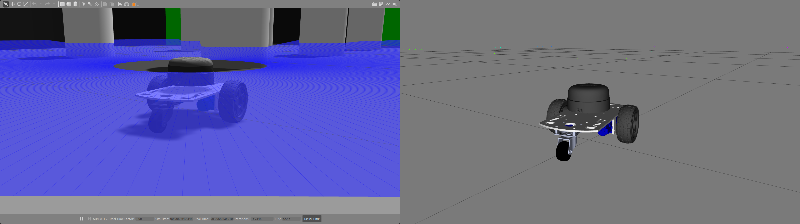
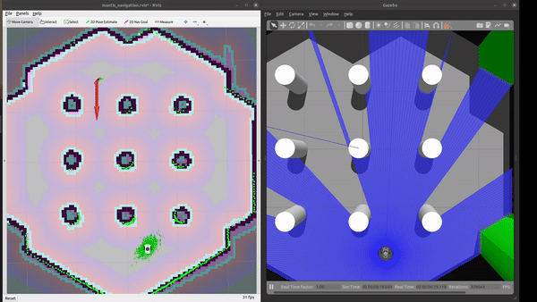
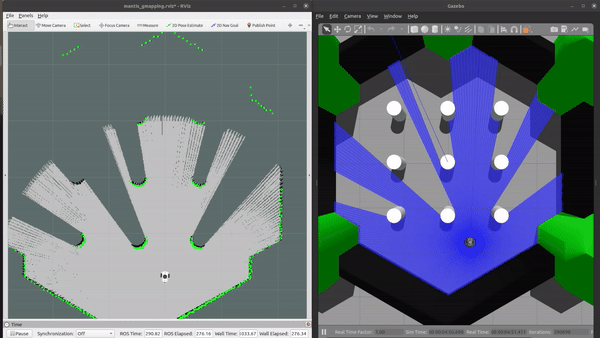

# Mantis 


Mantis is an autonomous differential drive robot with two wheels. Its main processing unit is a Jetson Nano running Ubuntu Mate 20.04 and the ROS 1 (ROS Noetic) middleware. This respository contains ROS driver packages, ROS Control Hardware Interface for the real robot and configurations for simulating Mantis.

| Gazebo Simulation  |
|:--------------:|
| [](https://drive.google.com/file/d/1DC2zO55V3mRGcUTuGfHqzyOxiB6hiH4j/view?usp=sharing) |

It provides mounts for different camera modules, such as Realsense D435 and you can even design your own if you like. There is also support for different single board computers (Nvidia Jetson Nano) through two changable decks.

## Package: Package Overview

- [`mantis_base`](./mantis_base): ROS Control hardware interface including [`controller_manager`](http://wiki.ros.org/controller_manager) control loop for the real robot. The [`scripts folder`](./mantis_base/scripts) of this package contains the low-level `base_controller` that is running on the Teensy microcontroller.
- [`mantis_bringup`](./mantis_bringup): Launch files to bring up the hardware drivers (camera, lidar, imu, ultrasonic, ...) for the real mantis robot.
- [`mantis_control`](./mantis_control): Configurations for the [`diff_drive_controller`](http://wiki.ros.org/diff_drive_controller) of ROS Control used in Gazebo simulation and the real robot.
- [`mantis_description`](./mantis_description): URDF description of mantis including its sensors.
- [`mantis_gazebo`](./mantis_gazebo): Simulation specific launch and configuration files for mantis.
- [`mantis_msgs`](./mantis_msgs): Message definitions specific to mantis, for example the message for encoder data.
- [`mantis_navigation`](./mantis_navigation): Navigation based on [`move_base` package](http://wiki.ros.org/move_base); launch and configuration files.
- [`mantis_slam`](./mantis_slam): Simultaneous localization and mapping using different implementations (e.g., [gmapping](http://wiki.ros.org/gmapping)) to create a map of the environment


## Dependencies

The required Ubuntu packages are listed in software package sections found in the [documentation](https://ros-mobile-robots.com/packages/packages-setup/#obtain-system-dependencies). Other ROS catkin packages such as [`rplidar_ros`](https://github.com/Slamtec/rplidar_ros) need to be cloned into the catkin workspace.

For an automated and simplified dependency installation process install the [`vcstool`](https://github.com/dirk-thomas/vcstool), which is used in the next steps.

```console
sudo apt install python3-vcstool
```

## How to Build

To build the packages in this repository including the Remo robot follow these steps:

1. `cd` into an existing ROS Noetic [catkin workspace](http://wiki.ros.org/catkin/Tutorials/create_a_workspace) or create a new one:
   ```console
   mkdir -p catkin_ws/src
   ```

2. Clone this repository in the `src` folder of your ROS Noetic catkin workspace:

   ```console
   cd catkin_ws/src
   ```

   ```console
   git clone https://github.com/Aakash872/mantis
   ```
   
3. Execute the `vcs import` command from the root of the catkin workspace and pipe in the `mantis_dev.repos` or `remo_robot.repos` YAML file, depending on where you execute the command, either the development PC or the SBC of Remo to clone the listed dependencies. Run the following command only on your development machine:

   ```
   vcs import < src/mantis/mantis_dev.repos
   ```roslaunch mantis_navigation mantis.launch

   
4. Install the requried binary dependencies of all packages in the catkin workspace using the following [`rosdep` command](http://wiki.ros.org/rosdep#Install_dependency_of_all_packages_in_the_workspace):

   ```
   rosdep install --from-paths src --ignore-src -r -y
   ```

5. After installing the required dependencies build the catkin workspace, either with [`catkin_make`](http://wiki.ros.org/catkin/commands/catkin_make):

   ```console
   catkin_ws$ catkin_make
   ```
   or using [catkin-tools](https://catkin-tools.readthedocs.io/en/latest/):

   ```console
   catkin_ws$ catkin build
   ```
   
6. Finally, source the newly built packages with the `devel/setup.*` script, depending on your used shell:

   For bash use:

   ```console
   catkin_ws$ source devel/setup.bash
   ```

   For zsh use:

   ```console
   catkin_ws$ source devel/setup.zsh
   ```

## Usage

The following sections describe how to run the robot simulation and how to make use of the real hardware using the available package launch files.

### Gazebo Simulation with ROS Control

Control the robot inside Gazebo and view what it sees in RViz using the following launch file:

```console
roslaunch mantis_control mantis.launch
```

This will launch the default mantis world `turtlebot3_world.world`.
| `turtlebot3_world.world` | 
|:-------------------------:|
|  |

#### Navigation

To navigate the robot in the Gazebo simulator in `turtlebot3_world.world` run the command:

```console
roslaunch mantis_navigation mantis.launch
```

This uses a previously mapped map of `turtlebot3_world.world` (found in [`mantis_navigation/maps`](./mantis_navigation/maps/)) that is served by
the [`map_server`](http://wiki.ros.org/map_server). With this you can use the [2D Nav Goal in RViz](http://wiki.ros.org/navigation/Tutorials/Using%20rviz%20with%20the%20Navigation%20Stack#A2D_Nav_Goal) directly to let the robot drive autonomously in the `turtlebot3_world.world`.

[](https://youtu.be/iNjbmFIW6jo)

#### SLAM

To map a new simulated environment using slam gmapping, first run

```console
roslaunch mantis_gazebo mantis.launch world_name:='$(find mantis_gazebo)/worlds/turtlebot3_world.world'
```

and in a second terminal execute

```console
roslaunch mantis_slam mantis_slam.launch slam_method:=gmapping
```

Then explore the world with the [`teleop_twist_keyboard`](http://wiki.ros.org/teleop_twist_keyboard) or with the already launched [`rqt_robot_steering`](https://wiki.ros.org/rqt_robot_steering) GUI plugin:

[](https://youtu.be/x20P0w9mMf4)

When you finished exploring the new world, use the [`map_saver`](http://wiki.ros.org/map_server#map_saver) node from the [`map_server`](http://wiki.ros.org/map_server) package to store the mapped enviornment:

```console
rosrun map_server map_saver -f ~/map
```


### Navigating and Mapping on the real Robot

Start by setting up the ROS Network, by making the development PC the rosmaster set the `ROS_MASTER_URI` environment variable accordingly, 
Then follow the steps listed below to run the real mantis or Remo robot hardware:

1. First, brinup the robot hardware including its laser with the following launch file from the [`mantis_bringup`](./mantis_bringup) package.
Make sure to run this on the real robot (e.g. connect to it via `ssh`):

   ```console
   roslaunch mantis_bringup bringup_with_laser.launch
   ```

2. Then, in a new terminal on your remote/work development machine (not the single board computer) run the slam gmapping with the same command as in the simulation:

   ```console
   roslaunch mantis_slam mantis_slam.launch slam_method:=gmapping
   ```

   As you can see in the video, this should open up RViz and the [`rqt_robot_steering`](http://wiki.ros.org/rqt_robot_steering) plugin.

3. Next, steer the robot around manually either using the `keyboard_teleop` node or using the `rqt_robot_steering` node 
and save the map with the following command when you are done exploring:

   ```console
   rosrun map_server map_saver -f real-world
   ```

After the mapping process it is possible to use the created map for navigation, after running the following launch files:

1. On the single board computer (e.g. Jetson nano) make sure that the following is launched:

   ```console
   roslaunch mantis_bringup bringup_with_laser.launch
   ```

2. Then on the work/remote development machine run the `mantis_hw.lauch` from the `mantis_navigation` package:

   ```console
   roslaunch mantis_navigation mantis_hw.lauch
   ```

   Among other essential navigation and map server nodes, this will also launch an instance of RViz on your work pc where you can use its tools to: 

   1. Localize the robot with the "2D Pose Estimate" tool (green arrow) in RViz
   2. Use the "2D Nav Goal" tool in RViz (red arrow) to send goals to the robot

## References

